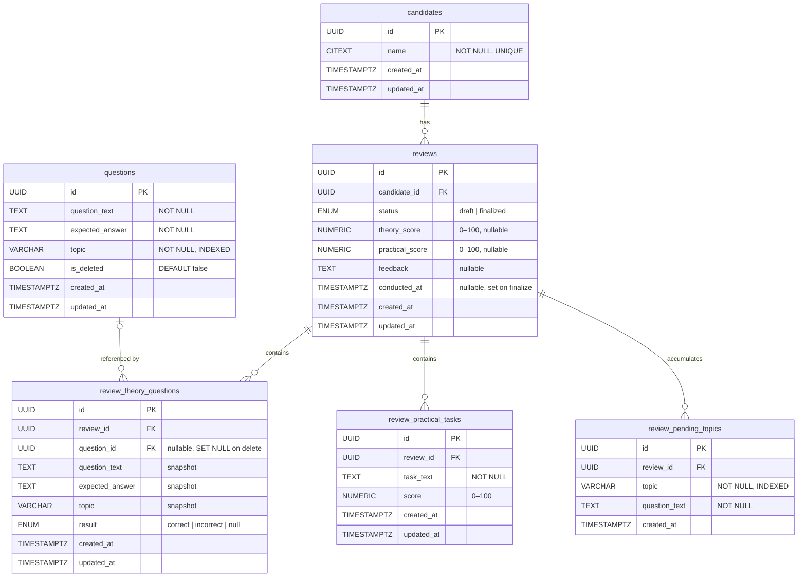

# Interview Tracker — Entity Relationship Diagram



---

## Relationship Notes

| Relationship | Cardinality | On Delete |
|---|---|---|
| `candidates` → `reviews` | One-to-Many | `RESTRICT` — cannot delete a candidate who has reviews |
| `reviews` → `review_theory_questions` | One-to-Many | `CASCADE` — deleting a review removes its theory questions |
| `reviews` → `review_practical_tasks` | One-to-Many | `CASCADE` — deleting a review removes its practical tasks |
| `reviews` → `review_pending_topics` | One-to-Many | `CASCADE` — deleting a review removes its pending topics |
| `questions` → `review_theory_questions` | One-to-Many (nullable) | `SET NULL` — deleting a question nullifies the FK but preserves the snapshot |

---

## Key Design Patterns

### Snapshot Pattern
`review_theory_questions` copies `question_text`, `expected_answer`, and `topic` from the source question at the moment it is added to the review. This means:
- Editing or deleting a question from the bank never corrupts historical review data.
- The `question_id` FK is kept (nullable) purely for traceability — it becomes `NULL` if the source is deleted.

### One Draft Per Candidate Constraint
The `reviews` table uses a PostgreSQL `EXCLUDE` constraint to enforce that a candidate can only have one active draft at a time:
```sql
EXCLUDE USING btree (candidate_id WITH =) WHERE (status = 'draft')
```

### Denormalized Pending Topics
`review_pending_topics` is populated whenever a theory question is marked `incorrect`. Although this data could be derived by querying `review_theory_questions WHERE result = 'incorrect'`, storing it separately allows the dashboard's "top failed topics" query to run as a simple `GROUP BY topic` on a small, well-indexed table rather than a heavier join.

### Soft Delete for Questions
Questions use an `is_deleted` flag rather than a hard `DELETE`. This keeps referential integrity intact and provides a recovery path, while partial indexes (`WHERE is_deleted = FALSE`) ensure active-question queries remain fast.

---

## Index Summary

| Table | Index | Purpose |
|---|---|---|
| `candidates` | `idx_candidates_name` | Name search / uniqueness |
| `questions` | `idx_questions_topic` | Filter by topic (active only) |
| `questions` | `idx_questions_is_deleted` | Soft-delete filtering |
| `reviews` | `idx_reviews_candidate_conducted` | Candidate history (ordered by date) |
| `reviews` | `idx_reviews_conducted_at` | Dashboard date-range filter |
| `reviews` | `idx_reviews_status` | Draft lookup |
| `review_theory_questions` | `idx_rtq_review_id` | Fetch theory questions for a review |
| `review_theory_questions` | `idx_rtq_result` | Score computation (count correct/incorrect) |
| `review_practical_tasks` | `idx_rpt_review_id` | Fetch practical tasks for a review |
| `review_pending_topics` | `idx_rpen_topic` | Dashboard topic aggregation |
| `review_pending_topics` | `idx_rpen_topic_review` | Topic aggregation with review join |
