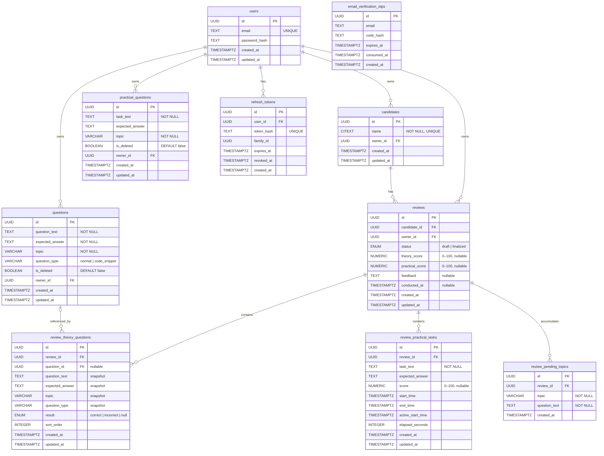

# Interview Tracker — Entity Relationship Diagram

```mermaid
erDiagram
    users {
        UUID id PK
        TEXT email "UNIQUE"
        TEXT password_hash
        TIMESTAMPTZ created_at
        TIMESTAMPTZ updated_at
    }

    candidates {
        UUID id PK
        CITEXT name "NOT NULL, UNIQUE"
        UUID owner_id FK
        TIMESTAMPTZ created_at
        TIMESTAMPTZ updated_at
    }

    questions {
        UUID id PK
        TEXT question_text "NOT NULL"
        TEXT expected_answer "NOT NULL"
        VARCHAR topic "NOT NULL"
        VARCHAR question_type "normal | code_snippet"
        BOOLEAN is_deleted "DEFAULT false"
        UUID owner_id FK
        TIMESTAMPTZ created_at
        TIMESTAMPTZ updated_at
    }

    practical_questions {
        UUID id PK
        TEXT task_text "NOT NULL"
        TEXT expected_answer
        VARCHAR topic "NOT NULL"
        BOOLEAN is_deleted "DEFAULT false"
        UUID owner_id FK
        TIMESTAMPTZ created_at
        TIMESTAMPTZ updated_at
    }

    reviews {
        UUID id PK
        UUID candidate_id FK
        UUID owner_id FK
        ENUM status "draft | finalized"
        NUMERIC theory_score "0–100, nullable"
        NUMERIC practical_score "0–100, nullable"
        TEXT feedback "nullable"
        TIMESTAMPTZ conducted_at "nullable"
        TIMESTAMPTZ created_at
        TIMESTAMPTZ updated_at
    }

    review_theory_questions {
        UUID id PK
        UUID review_id FK
        UUID question_id FK "nullable"
        TEXT question_text "snapshot"
        TEXT expected_answer "snapshot"
        VARCHAR topic "snapshot"
        VARCHAR question_type "snapshot"
        ENUM result "correct | incorrect | null"
        INTEGER sort_order
        TIMESTAMPTZ created_at
        TIMESTAMPTZ updated_at
    }

    review_practical_tasks {
        UUID id PK
        UUID review_id FK
        TEXT task_text "NOT NULL"
        TEXT expected_answer
        NUMERIC score "0–100, nullable"
        TIMESTAMPTZ start_time
        TIMESTAMPTZ end_time
        TIMESTAMPTZ active_start_time
        INTEGER elapsed_seconds
        TIMESTAMPTZ created_at
        TIMESTAMPTZ updated_at
    }

    review_pending_topics {
        UUID id PK
        UUID review_id FK
        VARCHAR topic "NOT NULL"
        TEXT question_text "NOT NULL"
        TIMESTAMPTZ created_at
    }

    refresh_tokens {
        UUID id PK
        UUID user_id FK
        TEXT token_hash "UNIQUE"
        UUID family_id
        TIMESTAMPTZ expires_at
        TIMESTAMPTZ revoked_at
        TIMESTAMPTZ created_at
    }

    email_verification_otps {
        UUID id PK
        TEXT email
        TEXT code_hash
        TIMESTAMPTZ expires_at
        TIMESTAMPTZ consumed_at
        TIMESTAMPTZ created_at
    }

    users ||--o{ candidates : owns
    users ||--o{ questions : owns
    users ||--o{ practical_questions : owns
    users ||--o{ reviews : owns
    users ||--o{ refresh_tokens : has

    candidates ||--o{ reviews : has
    reviews ||--o{ review_theory_questions : contains
    reviews ||--o{ review_practical_tasks : contains
    reviews ||--o{ review_pending_topics : accumulates

    questions |o--o{ review_theory_questions : referenced_by
```

---

## Relationship Notes

| Relationship | Cardinality | On Delete |
|---|---|---|
| `users` → `candidates` | One-to-Many | `SET NULL` on owner removal |
| `users` → `questions` | One-to-Many | `SET NULL` on owner removal |
| `users` → `reviews` | One-to-Many | `SET NULL` on owner removal |
| `candidates` → `reviews` | One-to-Many | `RESTRICT` |
| `reviews` → `review_theory_questions` | One-to-Many | `CASCADE` |
| `reviews` → `review_practical_tasks` | One-to-Many | `CASCADE` |
| `reviews` → `review_pending_topics` | One-to-Many | `CASCADE` |
| `questions` → `review_theory_questions` | One-to-Many (nullable) | `SET NULL` |

---

## Current Design Notes

- The app uses a soft-delete pattern for questions and practical questions with `is_deleted` flags.
- Review snapshots preserve question text and answers even when the source question is later removed or edited.
- Review practical tasks support pause/resume timing through `start_time`, `end_time`, `active_start_time`, and `elapsed_seconds`.
- The database also supports auth features via `users`, `refresh_tokens`, and `email_verification_otps`.
